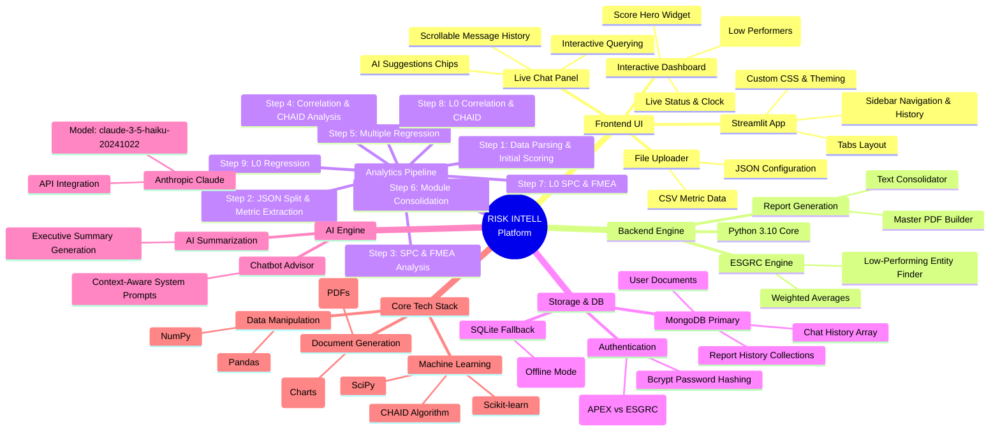

# RISK INTELL Platform - Architecture & Mindmap

This document visualizes the architecture, tech stack, and data flow of the **RISK INTELL Platform (ESGRC)** application in highly granular detail.

## 🧠 Comprehensive Architecture Mindmap

The mindmap below extensively details the core components, tech stack, modular structure, database schemas, and the 9-step pipeline of the application.



## 🔄 Detailed System Architecture & Data Flow

The flowchart below traces the exact step-by-step workflow, diving deep into the inner workings of the 9-step Machine Learning pipeline and its integrations with MongoDB and Anthropic.

```mermaid
graph TD
    %% Styling
    classDef frontend fill:#085558,stroke:#84BABF,stroke-width:2px,color:#fff;
    classDef backend fill:#0D6F73,stroke:#84BABF,stroke-width:2px,color:#fff;
    classDef database fill:#06363D,stroke:#84BABF,stroke-width:2px,color:#fff;
    classDef ai fill:#0284C7,stroke:#BAE6FD,stroke-width:2px,color:#fff;
    classDef output fill:#10B981,stroke:#86EFAC,stroke-width:2px,color:#fff;
    classDef pipeline fill:#B45309,stroke:#FDE68A,stroke-width:2px,color:#fff;

    User((User)) -->|1. Sign in (Bcrypt Auth)| DB[MongoDB / SQLite]:::database
    User -->|2. Uploads CSV/JSON| UI[Streamlit UI Interface]:::frontend
    
    subgraph FrontendLayer [React / Streamlit UI]
        UI
    end

    subgraph BackendPipeline [ML Pipeline Engine]
        direction TB
        P1[Step 1: ESGRC Low Perf]:::pipeline
        P2[Step 2: Sub-Module Split]:::pipeline
        P3[Step 3: SPC & FMEA Analysis]:::pipeline
        P4[Step 4: Correlation & CHAID]:::pipeline
        P5[Step 5: Multiple Regression]:::pipeline
        P6[Step 6: Consolidation]:::pipeline
        P7[Step 7: L0 SPC & FMEA]:::pipeline
        P8[Step 8: L0 Correlation & CHAID]:::pipeline
        P9[Step 9: L0 Regression Analysis]:::pipeline
        
        P1 -->|Metric Scores| P2
        P2 -->|Split JSONs| P3
        P3 -->|Control Charts| P4
        P4 -->|Feature Importance| P5
        P5 -->|Coef. Data| P6
        P6 -->|Joined Matrix| P7
        P7 -->|L0 Charts| P8
        P8 -->|L0 Trees| P9
    end

    UI -->|3. Triggers Analytics| P1
    
    P9 -->|4. Master Consolidator| Engine[Report Engine]:::backend
    
    subgraph AILayer [Anthropic Layer]
        LLM{Anthropic Claude 3.5 Haiku}:::ai
    end
    
    Engine -->|5. Sends Context| LLM
    LLM -->|6. Returns Executive Summary| Engine
    
    subgraph OutputGeneration [Document Generation]
        PDF[Master PDF Generator]:::backend
        Text[Consolidated Text Output]:::backend
    end
    
    Engine -->|7. Formats Report| PDF
    Engine -->|7. Formats Report| Text
    
    PDF --> Final((Final Report & Charts)):::output
    Text --> Final
    
    Final -->|8. Save Results & Content| DB
    Final -->|9. Display Results| UI
    
    UI <-->|10. Live Interactive Chat| LLM
```

## 🛠️ Technology Stack Breakdown

* **Frontend:** Streamlit, React (Underlying framework), Custom CSS styling
* **Backend:** Python 3, `utils/pipeline_engine.py`, `utils/esgrc_engine.py`
* **Data Processing & ML:** Pandas, NumPy, Scikit-Learn, SciPy, CHAID
* **Database:** PyMongo (MongoDB cluster), SQLite (Local Fallback), Bcrypt (Password hashing)
* **AI & LLM:** Anthropic API (Claude-3-5-Haiku model)
* **Document Generation:** ReportLab (PDF Generation), Matplotlib (Charting)
