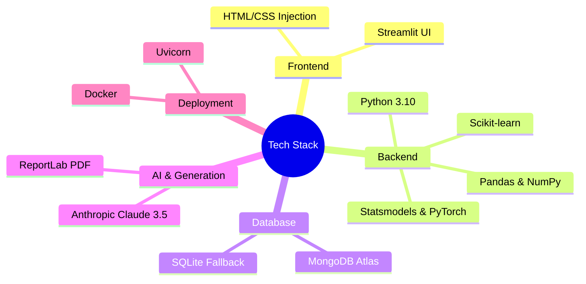
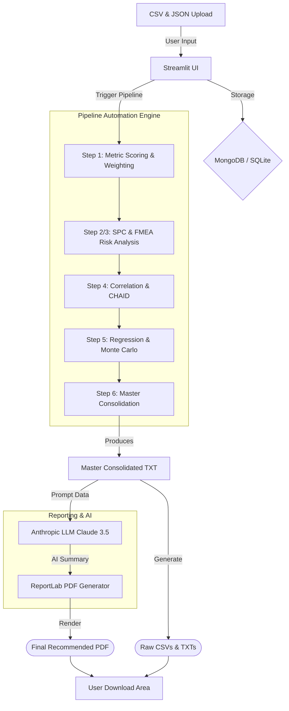

# RISK INTELL Platform (ESGRC v2.0)

The **RISK INTELL Platform** is an enterprise-grade Streamlit application designed for Environmental, Social, Governance, Risk, and Compliance (ESGRC) performance analysis and AI-driven reporting.

## 🚀 Features

- **Secure Authentication**: User login and registration, securely storing data in a local database or MongoDB Atlas.
- **Data Ingestion**: Upload metric values (CSV) and configuration definitions (JSON) to evaluate ESG performance.
- **Advanced Machine Learning**: Uses Multiple Regression, PyTorch deep learning, SPC, FMEA, and CHAID decision trees to forecast risk and detect anomalies.
- **AI-Driven Insights**: Leverages Anthropic's Claude 3.5 Sonnet to generate comprehensive executive summaries based on your specific ESG data entirely offline-style.
- **Professional Reporting**: Export highly detailed performance reports directly to dynamic PDFs.
- **Interactive AI Chat**: A built-in AI assistant panel to answer questions about the generated report and provide actionable ESG and compliance advice.

---

## 🧠 Tech Stack & Architecture



---

## 🔄 Data Flow & Pipeline Automation



---

## 🛠️ Local Setup Instructions

### Prerequisites
- Python 3.10+
- MongoDB Atlas Account (or local MongoDB)
- Anthropic API Key

### 1. Clone & Install
```bash
git clone https://github.com/code0era/esgrc.git
cd esgrc-streamlit
pip install -r requirements.txt
```

### 2. Configure Secrets
Create a `.streamlit/secrets.toml` file in the root directory:
```toml
ANTHROPIC_API_KEY = "your-anthropic-api-key"
MONGODB_URI = "mongodb+srv://<username>:<password>@cluster0.mongodb.net/?appName=Cluster0"
MONGODB_DB = "esgrc_db"
APP_SECRET_KEY = "your-secret-key"
```

### 3. Run the Application
```bash
streamlit run app.py
```
*Note: If MongoDB blocks your IP, the app will safely fallback to local `esgrc_local.db` SQLite storage!*

---

## 🐳 Docker Containerization

This project includes a `Dockerfile` for seamless deployment.

### 1. Build the Docker Image
```bash
docker build -t risk-intell-app .
```

### 2. Run the Docker Container
Ensure you pass in your secrets, or mount your `.streamlit` folder!
```bash
docker run -p 8501:8501 -v $(pwd)/.streamlit:/app/.streamlit risk-intell-app
```
Access the app at `http://localhost:8501`.
