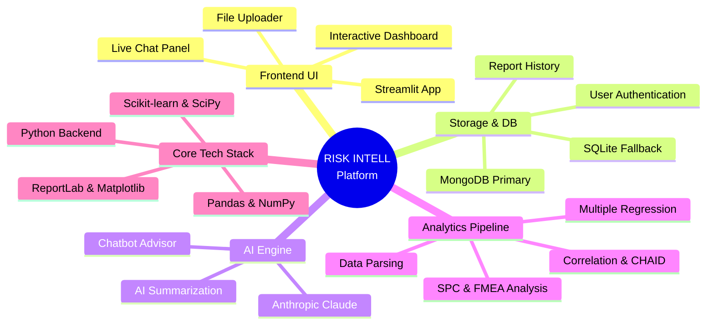
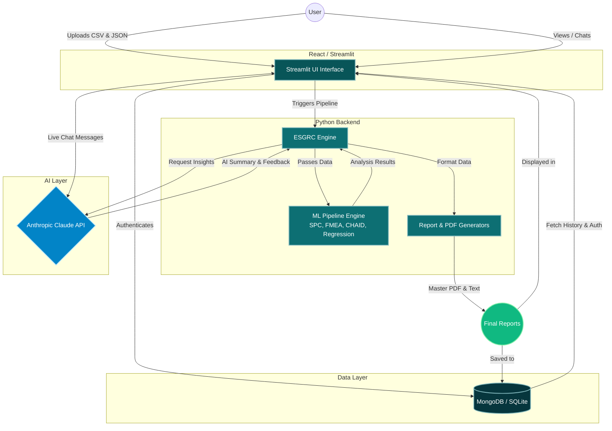

# 🛡️ RISK INTELL Platform (ESGRC)

An enterprise-grade ESG (Environmental, Social, Governance), Risk, and Compliance Management Platform built with Streamlit. It leverages powerful machine learning pipelines (SPC, FMEA, CHAID, Multiple Regression) and AI-driven summarization (Anthropic Claude 3.5) to deliver intelligent analytics, reporting, and interactive conversational insights on enterprise compliance data.

---

## 🧠 Architecture Mindmap

The mindmap below outlines the core components, tech stack, and modular structure of the application.



---

## 🔄 System Architecture & Data Flow

The flowchart below visualizes how data moves through the application, from user input to final PDF generation and AI interaction.



---

## ✨ Features

- **Automated Data Ingestion:** Upload ESG Metric CSVs and JSON configurations.
- **Machine Learning Analytics:** Executes a 9-step automated pipeline comprising SPC (Statistical Process Control), FMEA, CHAID (Chi-square Automatic Interaction Detection), and Multiple Regression.
- **AI-Powered Insights:** Uses Anthropic's Claude 3.5 Haiku to provide concise executive summaries and an interactive chat assistant (Chatbot Advisor) specialized in ESG & Risk context.
- **Comprehensive Reporting:** Automatically generates high-quality PDF reports, text logs, and consolidated CSV output data for stakeholders.
- **Enterprise Security & Auth:** Features built-in user authentication (bcrypt) and securely stores configurations, reports, and chat history in MongoDB (or a local SQLite fallback).
- **Beautiful UI:** A modern, customized Streamlit interface using custom CSS for a premium, dashboard-like feel.

---

## 🛠️ Technology Stack Breakdown

* **Frontend:** Streamlit, React (Underlying framework), Custom CSS styling
* **Backend:** Python 3.10+, `utils/pipeline_engine.py`, `utils/esgrc_engine.py`
* **Data Processing & ML:** Pandas, NumPy, Scikit-Learn, SciPy, CHAID
* **Database:** PyMongo (MongoDB cluster), SQLite (Local Fallback), Bcrypt (Password hashing)
* **AI & LLM:** Anthropic API (Claude-3-5-Haiku model)
* **Document Generation:** ReportLab (PDF Generation), Matplotlib (Charting)

---

## 📂 Project Structure

```text
esgrc-streamlit/
│
├── app.py                      # Main Streamlit application entrypoint
├── requirements.txt            # Python dependencies
├── Dockerfile                  # Containerization setup
├── .streamlit/
│   └── secrets.toml            # (Not tracked) API keys & Secrets
├── utils/
│   ├── db.py                   # MongoDB & SQLite connection logic
│   ├── esgrc_engine.py         # Legacy standard report logic
│   ├── pipeline_engine.py      # Core 9-step ML automated pipeline logic
│   ├── pipeline_flows.py       # Streamlit UI wrappers for pipelines
│   ├── pdf_report.py           # Standard PDF Generator
│   ├── master_pdf.py           # Master Consolidated PDF Generator
│   └── *.py                    # Individual ML Pipeline steps (Regression, CHAID, etc.)
└── README.md                   # This file
```

---

## 🚀 Setup & Installation

### Prerequisites

- Python 3.10+
- An Anthropic API Key for Claude AI functionality
- MongoDB Connection String (Optional, falls back to SQLite locally)

### 1. Local Setup

Clone the repository and set up a virtual environment:

```bash
# Clone the repository
git clone <repository_url>
cd esgrc-streamlit

# Create and activate virtual environment (Windows)
python -m venv venv
venv\Scripts\activate

# Create and activate virtual environment (Mac/Linux)
python3 -m venv venv
source venv/bin/activate
```

Install the required dependencies:

```bash
pip install -r requirements.txt
```

### 2. Environment Variables & Secrets

Streamlit handles secrets via `.streamlit/secrets.toml`. Create this file and add your credentials:

```bash
mkdir .streamlit
# Edit .streamlit/secrets.toml
```

Add the following to `.streamlit/secrets.toml`:

```toml
ANTHROPIC_API_KEY = "your-anthropic-api-key"
MONGO_URI = "your-mongodb-connection-string" # Optional
```

### 3. Run the Application

Start the Streamlit development server:

```bash
streamlit run app.py
```

The application will be available at `http://localhost:8501`.

---

## 🐳 Docker Deployment

You can also run the application seamlessly using Docker.

```bash
# Build the Docker image
docker build -t risk-intell-app .

# Run the container (pass your secrets as environment variables)
docker run -p 8501:8501 \
  -e ANTHROPIC_API_KEY="your-api-key-here" \
  risk-intell-app
```

---

## 📊 Sample Data

The application expects input in a specific format for the pipeline:
- **`input_metric_values_esgrc.csv`**: Contains the raw metric values for each module/sub-module.
- **`esgrc_performance_json_file.json`**: Contains the schema and configuration for scoring and analyzing groups.
